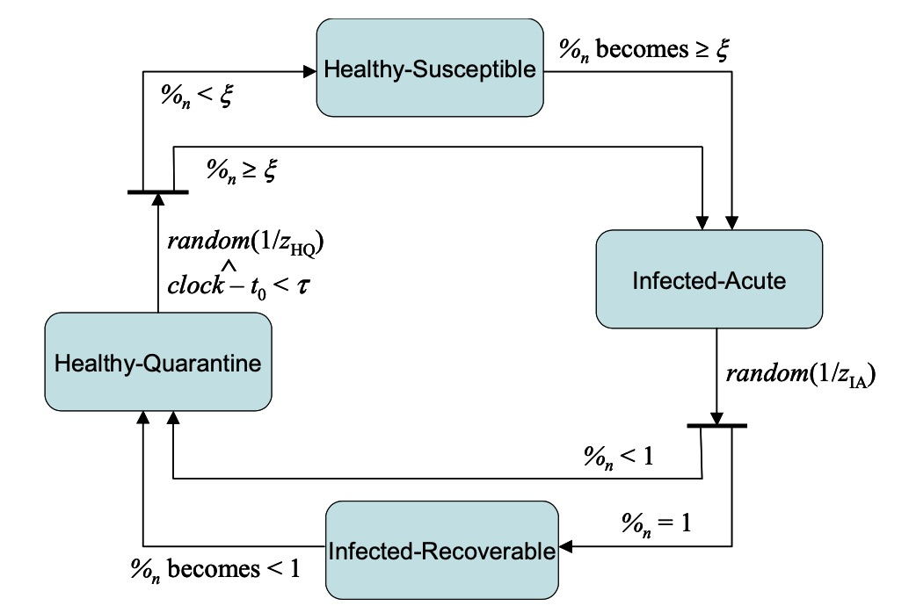
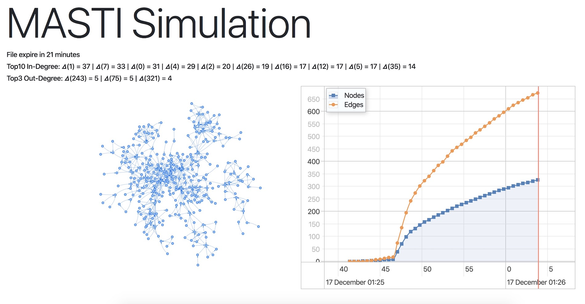

# MISS

How to prevent infection caused by stolen private key.



## Visual Simulation



visit [masti.stasbar.com](https://masti.stasbar.com)

## Fast command line simulation

Execute
`npm run simulate`

Options:
--in - input network json file path
--publications - number of external infection EIP publications
--xi - min. proportion of infected neighbours
--tau - time to immunization
--zhq - Mean time in Healthly-Quarantine (HQ) state
--zia - Mean time in Infected-Acute (IA) state
--iterations - Number of process iterations - higher number - more accurate results

Example:
`npm run simulate -- in=src/probdup/nodeEdge1000.json --publications=20 --xi=0.3`

```uml
Author->Author: Create and publish file
Author->Author: Calculate **hash**
Author->Smart Contract: token request(**hash**)
Smart Contract->Smart Contract: Check if **hash** already exists and when was last time spreaded
if: hash exists but is not allowed to spread yet
	Smart Contract-->Author: Reject(reason)
end 
Smart Contract-->Smart Contract: Calculate token based on **block hash** and **file hash**
Smart Contract-->Smart Contract: Store new **token** 
Smart Contract-->Smart Contract: expiration[**hash**] += expiration(n)
Smart Contract-->Author: Return **token**

Author->FB: This is my new file **link** and here is **token**
User->FB: Download file
User->User: Calculate hash
User->Smart Contract: Verify **token** validity for file **hash**
Smart Contract->Smart Contract: Check if **token** exists for file **hash** and expiration[**hash**] > NOW
if: token doesn't exist or has expired
	Smart Contract-->User: false
  note User: Terminate. User can not trust this file
end
Smart Contract-->User: true
note User: User can trust this file with (1/N * 100%) certainty


...: {fas-spinner} Delay *delay(n)* h before new spread is possible**

_: **From now we will loop the sequences**

Author->Smart Contract: token request(hash)
...: Create and store token
Smart Contract-->User: true
note User: User can trust this file with (2/N * 100%) certainty

...: {fas-spinner} Delay *delay(n)* h before new spread is possible**

Author->Smart Contract: token request(hash)
...: Create and store token


Smart Contract-->User: true
note User: User can trust this file with (N/N * 100%) certainty
```
https://swimlanes.io/#rVTBjtMwED3jr5gLog3asssx0q5UutpjkdgFDgghJ5kopq4d7AnZCPHvjJ2kDW1399IoaiT3zfO8N89eNlRZd3GzjN8UVg4lIUhTQN1kWvkKSqVRLA9xUueNDtAkqaSvkmQHud9KR7CyhpzMKQWyGzTg8FeDnmYjfC7+xx3XrSrMN6DK3Q4gNXdXdICPypOPTbYVc7fSg5aegNQWwdcBhYVQZQqhcsRnDYHyYCwxk7YtFtzbAIcOSbw6aGkv9xP+xJxmjPTWzAXyzof9nxCw86i3IJOet7SGBWXasrZRFrMlSbB5WHmZ+p6sQzDYcmEkZ5qXq/CxVk6Ssubb6Ol3eHs9WZ+Zo7lMTaDGmf2OYjfyuw8pPFTsLb/bLvYV5SSJVmYzSKyQW2bAvv6zx6H41rZGWx5DDFu/Hn6nJoaGh78OhX1Bp8pu4sVvqVWhqIPSurGV094+F7uRbcjPEVeUddLUG1h//BoD2I++sOjNG+qZgHkY2FdyTo9j10svpfYoIAQWoV96QLdVht1YxAXIpYl5JteE+IcRRAc5oMdz7CkYimJCueM54IBWUQWzq3drSODq8vL1HHJ0JJWhTvCzWCxS+FNKf+FrZQy6v3CLWvIUivDhJCVQQYblmNThoDF9bb1XmcYQoR8p23nn7JZ1tNCGbbUGbW3NrfBhDteGydFP4/b8DRNmMO/bm9xmPp6YiDyTM+9PO3MmX86lVZxJ7fqpHPADIP4B
